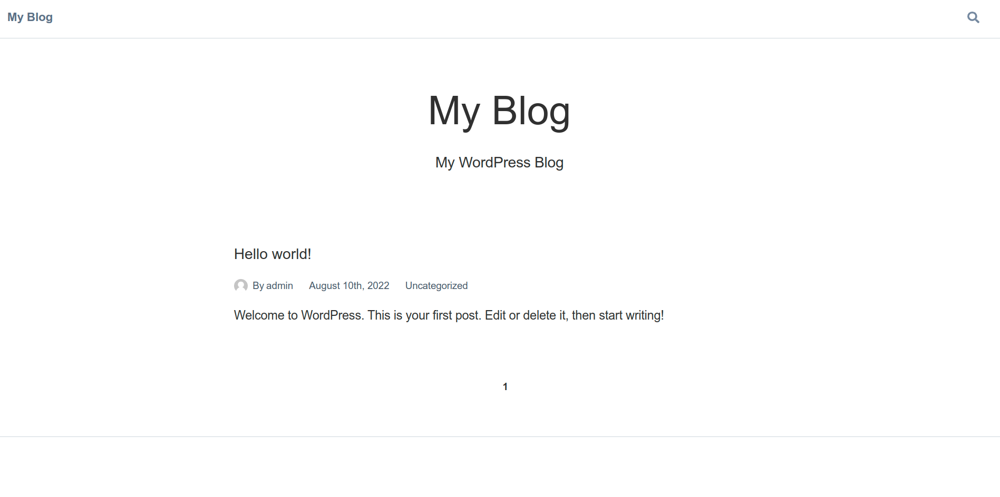

# 👨‍💻 Blog using Next.js, Wordpress Headeless CMS

### _Wordpress Blog using Next.js, GraphQL and Headless CMS. Tweak it and use it !!_

## Images

## Run Locally

- Run this command `git clone https://github.com/developer-junaid/DeveloperFolio.git`
- You are now in the dev environment and you can play around

## Tech Stack

- Used Next.js Starter Template (Read file: README_COPYRIGHT.nd)
- Next.js
- Wordpress Headless CMS
- GraphQL
- WPGraphQL (Wordpress Plugin)
- Easyhost for Hosting Wordpress Blog